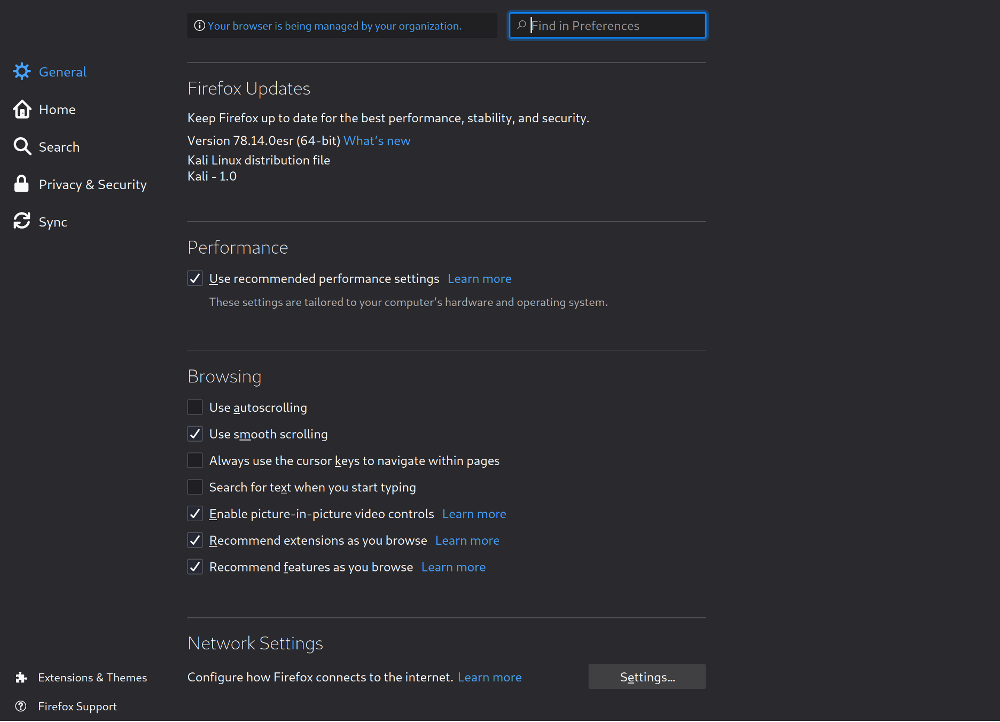

In questo laboratorio utilizzeremo la macchina virtuale **Kali Linux** e la macchina virtuale **Metasploitable2**. Le due macchine virtuali devono essere collegate da una rete interna.

# Attacchi offline
Gli attacchi offline vengono eseguiti senza interagire direttamente con il sistema di autenticazione, ma lavorando invece su dati acquisiti, come il file delle password che contiene gli hash delle password. 

## Attacco a dizionario  – documento pdf protetto da password

In un attacco a dizionario, l'attaccante utilizza un elenco predefinito di password comuni e parole presenti in un dizionario. Questo metodo è efficace perché molte persone utilizzano password semplici e prevedibili. L'attaccante confronta ogni parola del dizionario con l'hash della password rubata, cercando una corrispondenza. 

Eseguiremo un dictionary attack per scoprire la password del documento **confidential.pdf**.  L’hash della password che protegge l’accesso al documento è memorizzato nei metadati del documento. Per estrarre l’hash della password usiamo il tool **pdf2john.pl** di John The Ripper.

Aprite un terminale digitate i seguenti comandi
```
# cd <path alla cartella dove avete scompattato il password.zip>
# pdf2john confidential.pdf
```
Il comando restituirà il seguente valore

```
confidential.pdf:$pdf$4*4*128*-4*1*16*be67ac70a35391f5b6716bfe7c30af81*32*4f185e9a05c20bf7eb9aceea2d1e3a7d00000000000000000000000000000000*32*a6454eaef509a12ad3f3d3caaafe8acd835b0be4f56ceb5ac5dc733d9b838a4f
```
Dove l’hash della password è:
```
$pdf$4*4*128*-4*1*16*be67ac70a35391f5b6716bfe7c30af81*32*4f185e9a05c20bf7eb9aceea2d1e3a7d00000000000000000000000000000000*32*a6454eaef509a12ad3f3d3caaafe8acd835b0be4f56ceb5ac5dc733d9b838a4f
```
Per recuperare la password in chiaro utilizzeremo **Hashcat**. Hashcat è un potente strumento di cracking delle password che utilizza attacchi a forza bruta e attacchi a dizionario per recuperare password a partire dai loro hash. È molto apprezzato nella comunità della sicurezza informatica per la sua velocità, efficienza e flessibilità. Hashcat supporta una vasta gamma di algoritmi di hashing e può essere eseguito su diverse piattaforme hardware, inclusi CPU, GPU e dispositivi FPGA.

Digitate il seguente comando
```
hashcat -m 10500 -a 0 '$pdf$4*4*128*-4*1*16*be67ac70a35391f5b6716bfe7c30af81*32*4f185e9a05c20bf7eb9aceea2d1e3a7d00000000000000000000000000000000*32*a6454eaef509a12ad3f3d3caaafe8acd835b0be4f56ceb5ac5dc733d9b838a4f' dictionary.txt
```
dove 
*	-m 10500 indica la tipologia dell’hash utilizzato per proteggere la password
*	-a 0 indica la tipologia di attacco che in questo caso è un dictionary attack
*	‘password’ è l’hash della password da recuperare
*	dictionary.txt è il dizionario che viene utilizzato per recuperare la password
 

## Attacchi a Dizionario  – Craccare hash MD5

Eseguiremo un attacco a dizionario per scoprire le password presenti nel file hashes.txt contenuto nella cartella password.zip. Il file contiene 9 MD5 hashes.

Dal terminale digitate il seguente comando
```
hashcat -m 0 -a 0 hashes.txt  dictionary.txt
```
* -m 0 indica la tipologia dell’hash MD5
  
Per consentire di recuperare le altre password, eseguiremo un dictionary attack dove alle parole del dizionario applicheremo delle regole supportate da hashcat per rappresentare  patterns utilizzati dagli utenti nel formulare le loro passwords.

Utilizzeremo la regola _leapspeak.rule_ che si trova sotto la cartella _/usr/share/hashcat/rules/leetspeak.rule_. Questa regola va a sostituire le lettere che compongono le parole nel dizionario con simboli o numeri. Per esempio la parola password applicando questa regola può diventare “p455w0rd”, “p@5sw0rd”, “passw0rd”.

Per applicare la regola alle parole contenute nel dizionario dictionary.txt eseguiamo il seguente comando:
```
hashcat -m 0 -a 0 -r /usr/share/hashcat/rules/leetspeak.rule hashes.txt  dictionary.txt
```
Per consentire di recuperare le altre password, eseguiremo un attacco a dizionario applicando una maschera che rappresenta il pattern dove l’utente aggiunge dei numeri alla fine della password quali per esempio john22 o john2022.

Per applicare la maschera alle parole contenute nel dizionario dictionary.txt eseguiamo il seguente comando:
```
hashcat -m 0 -a 6 hashes.txt  dictionary.txt ?d?d?d?d
```
 
## Attacchi a Forza Bruta e a Dizionario con John The Ripper

Eseguiremo un attacco a forza bruta e un attacco a dizionario  per scoprire le password presenti nel file sensitive.txt contenuto nel file password.zip. Il file contiene 22 MD5 hashes. Utilizzeremo il tool **John The Ripper**. John the Ripper, spesso abbreviato in "John", è uno degli strumenti di cracking delle password più conosciuti e utilizzati nel campo della sicurezza informatica. Originariamente progettato per Unix, è ora disponibile per un'ampia gamma di piattaforme tra cui Windows, macOS e Linux. John the Ripper è utilizzato per rilevare password deboli, testare la robustezza delle password e migliorare la sicurezza delle credenziali.

Iniziamo conducendo un attacco a forza bruta. Un attacco a forza bruta tenta ogni possibile combinazione di caratteri fino a trovare la password corretta. Sebbene sia un metodo molto efficace, è anche estremamente dispendioso in termini di tempo e risorse computazionali, specialmente per password lunghe e complesse.

Dal terminale digitate i seguenti comandi:
```
john --incremental sensitive.txt
```
Per consentire di recuperare le altre password, eseguiremo un attacco a dizionario con il dizionario di John The Ripper che si trova sotto la cartella /usr/share/john/password.lst. Digitate il seguente comando:
```
john --wordlist=/usr/share/john/password.lst sensitive.txt
```

Ripetete l'attacco a dizionario utilizzando i dizionari che si trovano nel file password.zip: cain.txt  facebook-pastebay.txt  hotmail.txt  myspace.txt.

## Attacco a dizionario - Craccare le password di Metasploitable2

Eseguiremo una serie di attacchi a dizionario per scoprire le password presenti nei file passwd e shadow  che contengono gli username e gli hash delle password degli utenti che hanno accesso alla macchina Metasploitable2. 

Da terminale digitate il seguente comando per combinare i due file passwd e shadow in un unico file passwords.txt.
```
unshadow passwd.txt shadow.txt > passwords.txt
```
Adesso eseguiamo una serie di attacchi a dizionario con i dizionari che si trovano nel file password.zip: cain.txt, facebook-pastebay.txt  hotmail.txt, e myspace.txt. Digitate il seguente comando:
```
john –wordlist=< path al dizionario > passwords.txt
```
_Quali password siete riusciti a recuperare?_
 

# Attacchi online con Hydra 

Gli attacchi online ai sistemi di autenticazione basati su password sono tentativi di accedere a un sistema o a un account interagendo direttamente con il sistema di autenticazione attraverso la rete. A differenza degli attacchi offline, che si basano su dati rubati come hash di password e vengono eseguiti senza interagire con il sistema di autenticazione, gli attacchi online richiedono una connessione diretta al sistema di autenticazione e spesso coinvolgono l'invio di richieste ripetute per indovinare la password corretta.

Per questo attacco vi serviranno sia la macchina Kali Linux che la macchina Metasploitable2 dove è installata l’applicazione web di cui trovare la password DVWA. Per condurre l'attacco online utilizzeremo  **BurpSuite** per capire quali parametri vengono passati all’applicazione durante la fase di autenticazione, e **Hydra**. Hydra è un potente strumento di cracking delle password utilizzato per eseguire attacchi a forza bruta e attacchi a dizionario su vari protocolli di rete e servizi di autenticazione.

L’obiettivo dell’attacco è trovare la password di amministratore per accedere all’applicazione DVWA. 

Aprite il browser sulla macchina Kali e navigate all’URL http://<INDIRIZZO IP METASPLOITABLE2>

Dobbiamo configurare il browser per usare Burp Suite come proxy per intercettare la richiesta POST fatta all’applicazione quando un utente tenta di fare il login.

Andate sulle Preferenze del browser e cliccate su Network Settings in fondo alla pagina delle preferenze come illustrato nella figura qui sotto

 


Selezionate Manual proxy configuration e sia per il protocollo http che https specificate come indirizzo 127.0.0.1 e come porta 8080 e poi cliccate OK in fondo.
 
Aprite Burpsuite e accettate i termini e le condizioni per il servizio come illustrato nella figura qui sotto
 

Quando si presenta la seguente interfaccia cliccate Next 

Cliccate Start Burp come illustrato nella figura qui sotto
 

Cliccate su Proxy 

 


Se Intercept is on è evidenziato come illustrato nella figura qui sotto allora Burp Suite sta funzionando correttamente

 

Tornate sulla pagina di login di DVWA e provato a fare login

 


Burp Suite ha intercettato la POST request. Potete vedere che ci sono 3 parametri: username, password e Login che è l'azione che viene eseguita.
 
Aprite un terminale sulla macchina Kali e digitate il seguente comando

hydra -V -l admin -P /usr/share/john/password.lst <INDIRIZZO IP METASPLOITABLE2) http-post-form "/dvwa/login.php:username=^USER^&password=^PASS^&Login=Login:Login Failed"

                   dove 
* L’opzione -V indica la modalità verbose dove ogni password provata verrà stampata a video
* -l indica lo username di cui recuperare la password
* -P indica il dizionario da utilizzare per recuperare la password
* indica l’indirizzo IP del target da attaccare in questo caso la macchina Metasploitable2
* http-post-form indica che l’applicazione accetta richieste POST
* l’ultimo parametro indica l’URL della pagina di login e i parametri passati alla pagina di login che avevamo intercettato con Burp Suite


# Attacchi online con Metasploit

•Dobbiamo recuperare la password degli account root,  admin e user utilizzati per collegarsi alla applicazione myPhPAdmin sulla macchina Metasploitable2.

Creaiamo il file /tmp/users.txt gli utenti di cui recuperare la password e il file /tmp/passwords.txt.


Facciamo partire la console di Metasploit  con il comando msfconsole e poi cerchiamo il modulo di Metasploit che implementa un online dictionary attack verso l’applicazione myPhPAdmin: 

Selezioniamo l’opzione 1 e specifichiamo i vari parametri:
 
Dopo pochi secondi otterremo le password desiderate:


