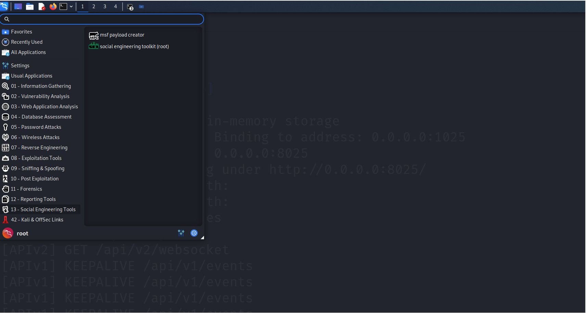
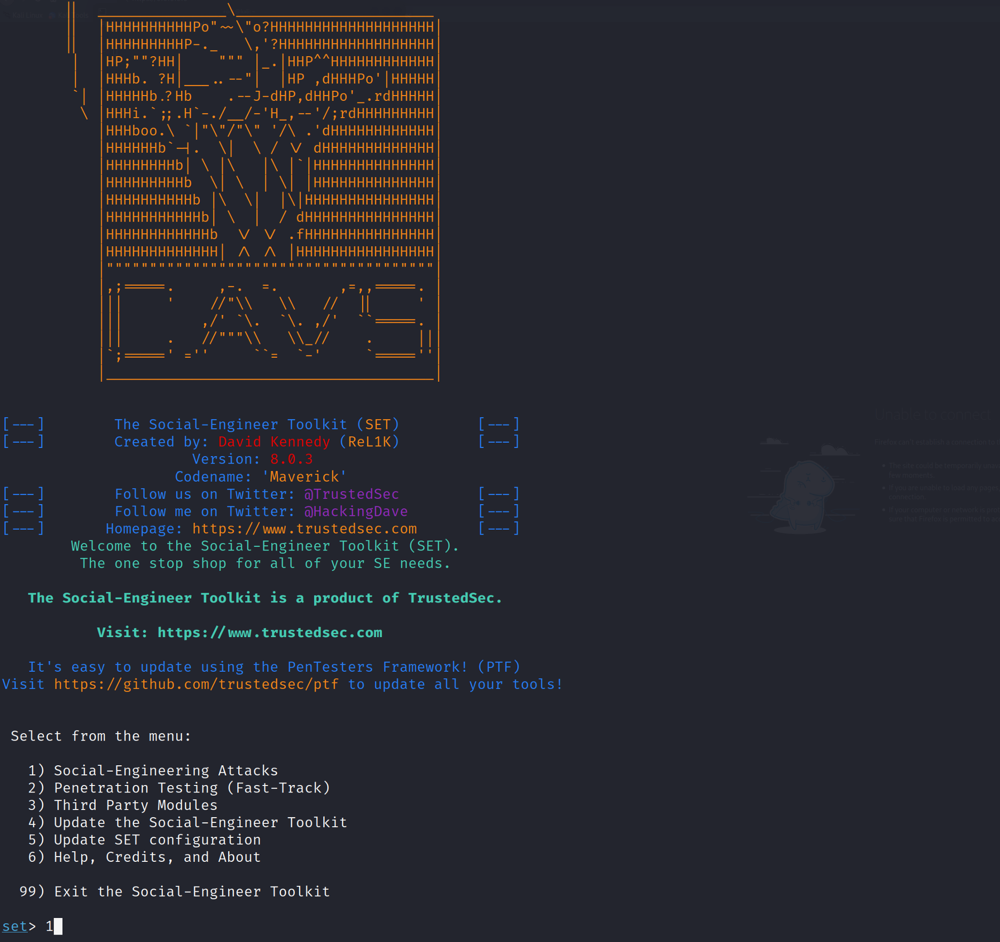
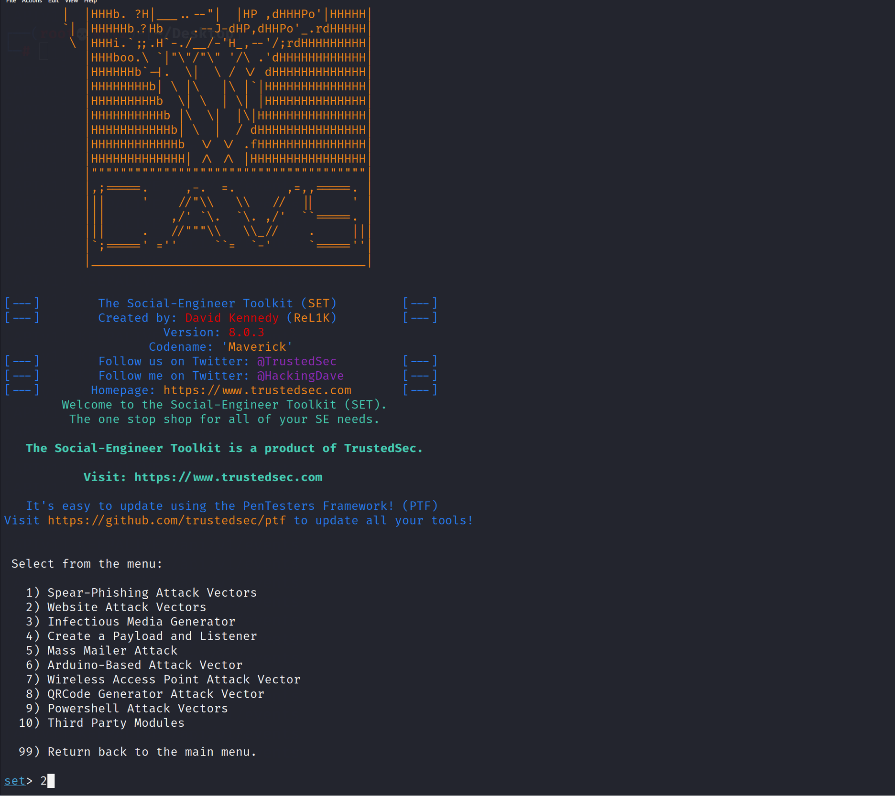
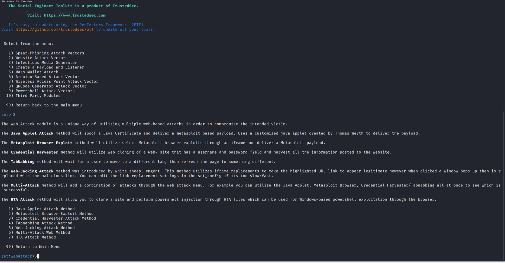
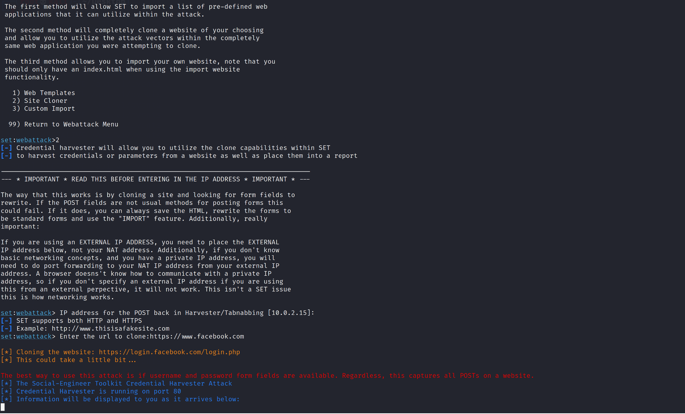
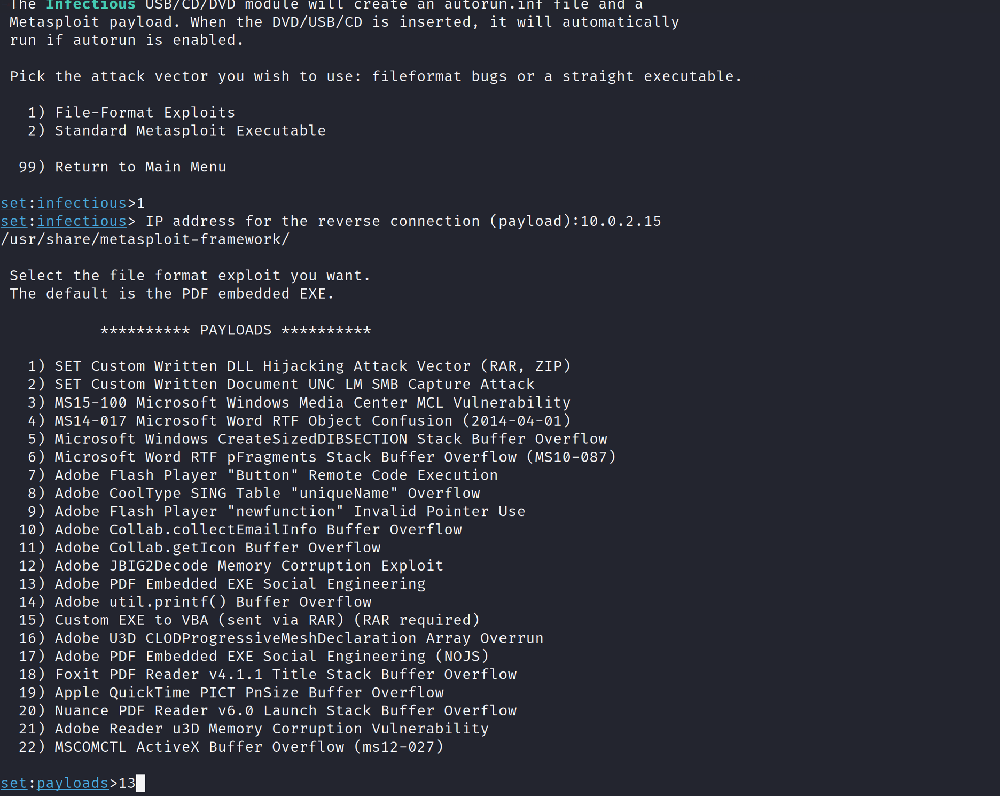

# Attacchi di Ingegneria Sociale

L'ingegneria sociale è una tecnica di manipolazione psicologica utilizzata per indurre le persone a divulgare informazioni confidenziali, eseguire azioni che compromettano la sicurezza o rivelare dati sensibili. Questa tecnica si basa sull'interazione umana e sfrutta la fiducia, la curiosità, la paura o l'ignoranza delle vittime per ottenere accesso a informazioni o sistemi protetti.

Per questa attivita' utilizzeremo la macchina **Kali Linux** e il **Social Engineering Tookit (SET)** installato sulla macchina Kali Linux. 
SET  offre una vasta gamma di funzionalità per simulare attacchi di ingegneria sociale e valutare la resilienza di individui e organizzazioni contro tali attacchi. 

Prima di condurre gli attacchi di ingegneria sociale utilizzando SET dobbiamo installare sulla macchina Kali Linux, due software **Mailhog** e **GoPhish**.

**Mailhog** è uno strumento di testing e sviluppo per le email. È un server SMTP simulato che cattura le email inviate dalle applicazioni in fase di sviluppo, consentendo agli sviluppatori di testare l'invio di email senza il rischio di inviare email reali a destinatari reali. MailHog fornisce un'interfaccia web semplice per visualizzare, cercare e gestire le email catturate.

**GoPhish** è uno strumento open source per la gestione e l'esecuzione di campagne di phishing simulato. È progettato per aiutare le organizzazioni a testare e migliorare la consapevolezza sulla sicurezza dei propri dipendenti. Con GoPhish, le organizzazioni possono creare e gestire campagne di phishing realistiche, monitorare le risposte dei destinatari e analizzare i risultati per identificare le aree in cui è necessario migliorare la formazione sulla sicurezza.

## Installazione Mailhog

Scaricate sulla macchina Kali Linux il file MailHog_linux_amd64 dal seguente url https://github.com/mailhog/MailHog/releases/v1.0.0.

Salvate il file MailHog_linux_amd64 sotto la cartella Desktop.

Aprite un terminale e digitate i seguenti comandi per dare permessi di esecuzione al file:

```
# chmod +x MailHog_linux_amd64
```
## Installazione GoPhish

Scaricate sulla macchina Kali Linux il file gophish-v0.12.1-linux-64bit.zip dal seguente url https://github.com/gophish/gophish/releases.

Estraete il file zip in una cartella sotto la cartella Desktop.
```
# chmod +x gophish
```
## Creare un sito di phishing per rubare credenziali


Eseguite il Social Engineering Toolkit dal menu principale della macchina Kali come illustrato nella figura qui sotto.



Selezionate l’opzione 1) Social Engineering Attacks



Selezionate l' opzione 2) Website Attack Vector



Selezionate l’opzione 3) Credential Harvester Attack Method



Selezionare l’opzione 2 Site Cloner 

Specificare come indirizzo IP quello della macchina Kali Linux

Specificare URL del sito da clonare. Il sito deve avere una form di login



Aprite Firefox e visitate il sito web digitando localhost nella barra degli indirizzi del browser e inserite un’ indirizzo email e una password fasulli


## Creare Chiavetta USB infetta 

Dal menu' principale di SET selezionare l'opzione 3) Infectious Media Generator.

Poi Selezionare Opzione 1 – File Format Exploits

Specificare indirizzo IP della macchina Kali Linux 

Selezionare Opzione 13 – Adobe PDF Embedded Social Engineering



Selezionare Opzione 2 – Use built-in BLANK PDF for attack

Selezionare opzione 5 – Windows Meterpreter Reverse_TCP (x64)

Lasciare come indirizzo IP e porta di default

Copiare la cartella /root/.set/autorun su una chiavetta USB


  
