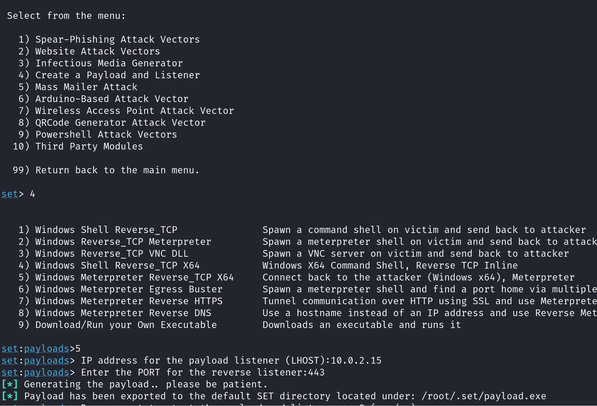
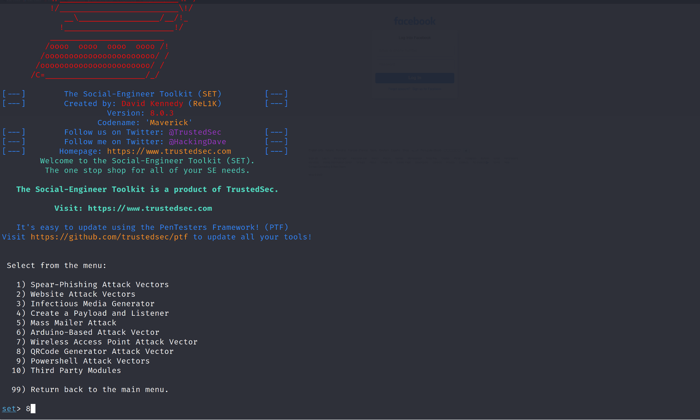
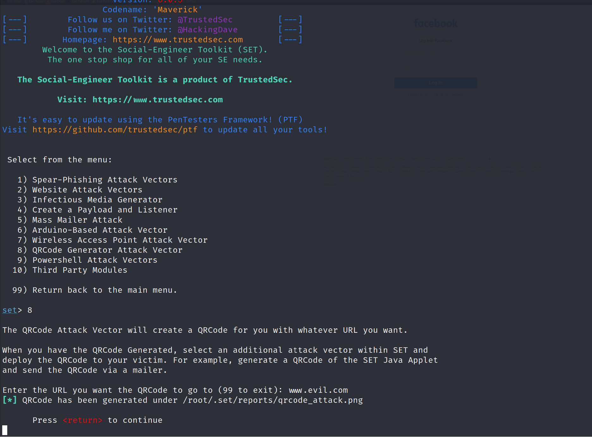

# Attacchi di Ingegneria Sociale con Social Engineering Toolkit (SET) 

L'ingegneria sociale è una tecnica di manipolazione psicologica utilizzata per indurre le persone a divulgare informazioni confidenziali, eseguire azioni che compromettano la sicurezza o rivelare dati sensibili. Questa tecnica si basa sull'interazione umana e sfrutta la fiducia, la curiosità, la paura o l'ignoranza delle vittime per ottenere accesso a informazioni o sistemi protetti.

Per questa attivita' utilizzeremo la macchina **Kali Linux** e il **Social Engineering Tookit (SET)** installato sulla macchina Kali Linux. 
SET  offre una vasta gamma di funzionalità per simulare attacchi di ingegneria sociale e valutare la resilienza di individui e organizzazioni contro tali attacchi. 

Prima di condurre gli attacchi di ingegneria sociale utilizzando SET dobbiamo installare sulla macchina Kali Linux il software **Mailhog**.

**Mailhog** è uno strumento di testing e sviluppo per le email. È un server SMTP simulato che cattura le email inviate dalle applicazioni in fase di sviluppo, consentendo agli sviluppatori di testare l'invio di email senza il rischio di inviare email reali a destinatari reali. MailHog fornisce un'interfaccia web semplice per visualizzare, cercare e gestire le email catturate.

## Installazione Mailhog

Scaricate sulla macchina Kali Linux il file MailHog_linux_amd64 dal seguente url https://github.com/mailhog/MailHog/releases/v1.0.0.

Salvate il file MailHog_linux_amd64 sotto la cartella Desktop.

Aprite un terminale e digitate i seguenti comandi per dare permessi di esecuzione al file:

```
# chmod +x MailHog_linux_amd64
```


## Creare un sito di phishing per rubare credenziali


Eseguite il Social Engineering Toolkit dal menu principale della macchina Kali come illustrato nella figura qui sotto.


Selezionate l’opzione 1) Social Engineering Attacks


Selezionate l' opzione 2) Website Attack Vector


Selezionate l’opzione 3) Credential Harvester Attack Method


Selezionare l’opzione 2 Site Cloner 

Specificare come indirizzo IP quello della macchina Kali Linux

Specificare URL del sito da clonare. Il sito deve avere una form di login


Aprite Firefox e visitate il sito web digitando localhost nella barra degli indirizzi del browser e inserite un’ indirizzo email e una password fasulli

## Creare un eseguibile malevolo per Windows

Dal menù principale del Social Engineering Toolkit selezionare opzione 4) Website Attack Vector

Poi selezionare l'opzione Windows Shell Reverse TCP x64.



Aprite un terminale e create un http server con il comando per trasferire il file sulla macchina della vittima.

```
python3 -m http.server 8888
```

## Creare Chiavetta USB infetta 

Dal menu' principale di SET selezionare l'opzione 3) Infectious Media Generator.

Poi Selezionare Opzione 1 – File Format Exploits

Specificare indirizzo IP della macchina Kali Linux 

Selezionare Opzione 13 – Adobe PDF Embedded Social Engineering


Selezionare Opzione 2 – Use built-in BLANK PDF for attack

Selezionare opzione 5 – Windows Meterpreter Reverse_TCP (x64)

Lasciare come indirizzo IP e porta di default

Esaminiamo il contenuto della cartella /root/.set/autorun. Copiamola sotto la cartella Desktop con il seguente comando
```
# sudo cp -R /root/.set/autorun ~/Desktop 
```
La cartella contiene un file **autorun.inf** e **template.pdf**. Esaminiamo il file autorun.inf con i seguenti comandi: 
```
# cd Desktop/autorun
# cat autorun.inf
```
Esaminiamo ora il file pdf malevolo **template.pdf**.  Un documento PDF inizia con un'intestazione che specifica la versione del formato PDF. Il corpo del PDF contiene tutti gli oggetti definiti nel documento. Gli oggetti possono includere testi, immagini, annotazioni, riferimenti ai font, e codice Javascript. In particolare gli oggetti di tipo stream possono contenere dati. Nel caso di un attacco di ingegneria sociale gli oggetti di tipo stream possono contenere eseguibili.  Ogni oggetto è identificato da un numero di oggetto e un numero di generazione, come nell'esempio è che segue:
```
5 0 obj
<< /Length 72 >>
stream
BT
/F1 12 Tf
100 700 Td
(Hello, World!) Tj
ET
endstream
endobj
``
Utilizziamo ora  **pdfid** per identificare gli oggetti presenti nel PDF. Questo strumento aiuta a rilevare elementi sospetti come JavaScript, oggetti embed, e altro.

```
 pdfid.py template.pdf

```

In particolare, cerchiamo nell'output parole chiave che possono ricondurre a comportamenti sospetti come /JavaScript, /OpenAction, /AA, /EmbededFile, /Launch, /Name, /URI ecc.

Ora utilizziamo **pdf-parser** per esaminare più in dettaglio i contenuti del PDF, specialmente gli oggetti sospetti identificati con pdfid.
```
pdf-parser.py -a template.pdf
```

Esamina gli oggetti uno per uno, prestando particolare attenzione agli oggetti che contengono JavaScript, collegamenti a URL esterni, o stream binari. Per esaminare il contenuto di un oggetto e' possibile utilizzare il seguente comando: 

```
pdf-parser.py -o <object_number> template.pdf
```
Per decodificare un oggetto e' possibile utilizzare il seguente comando:
```
pdf-parser.py -o <object_number> -f badpdf.pdf
```
Per identificare e estrarre gli oggetti JavaScript e' possibile utilizzare il seguente comando:
```
pdf-parser --object <object_number> -f -w -d objNUM.js badpdf.pdf
```
Analizza il JavaScript per identificare comportamenti dannosi, come il download di payload aggiuntivi o l'esecuzione di codice arbitrario.

Per completare l'attacco bisogna copiare il contenuto della cartella /root/.set/autorun su una chiavetta USB.

## Creare un QRCode Malevolo 

Selezionare Opzione 8) QRCode Generator Attack Vector 



Specificare l'url del sito web di phishing a cui redirigere le potenziali vittime 



Aprite qrcode_attack.png con un QRCode scanner online e.g Web QR per vedere che il QRCode punta al sito malevolo


# Sfruttare gli LLMs per condurre attacchi di ingegneria sociale

